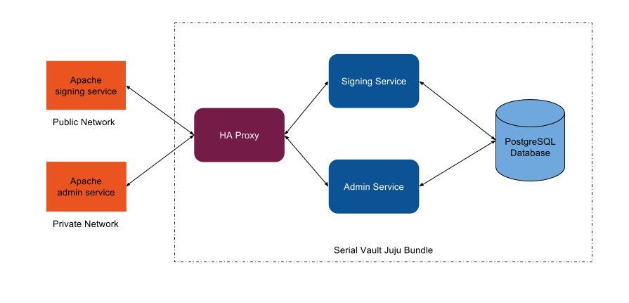

# Serial Vault Deployment Guidelines

## Overview



The Serial Vault is a web service that generates signed serial assertions for devices. It can be run in a data centre or on premises on a factory LAN.

The Serial Vault holds a list of approved models for a manufacturer, and the encrypted signing key(s) for the models. The service validates the model and logs if the serial number and device-key fingerprint have been previously used.

The application can operate in two modes:
- Signing: the service for generating signed serial assertions
- Admin: the service for registering new models and signing keys

The Admin and Signing services both operate under unencrypted HTTP connections, so it is left to the deployer to incorporate security measures around the services.
This guide provides some recommendations for deploying the services.

## Using the Juju Bundle

To simplify the deployment, a [Juju Bundle](https://jujucharms.com/u/jamesj/serial-vault-bundle/) is available at the [Charm Store](https://jujucharms.com/).
The bundle provides the core services for the Serial Vault, allowing the services to be scaled as necessary. Additional signing service unit can be added, if there is an increased load.
The HA Proxy service provides the load balancing for the additional units.

The Juju bundle does not provide secure system, as all operations are under unencrypted HTTP connections and the Admin service does not providing any authentication.
The secure connections and authentication need to be handled outside the bundled services. Typically, this will be done by adding front-end web servers that will provide SSL connections
and authentication for the Admin service. A typical approach would be to use two Apache web servers that provide the SSL connections and authentication for the Admin service. 

Admin service is protected against cross site request forgery attacks. That means it needs to be accessed through front-end web servers providing the SSL using a valid domain name certificate. It is important accessing the service not using the host IP but the domain name, otherwise requests modifying data won't allowed.

When Apache servers are deployed to provide front-end SSL services, it is important to consider the network availability of the servers. The Signing service can
deployed as a public service that is available on the Internet, but it may be useful to lock the service down so it is only available on a private network e.g. a factory LAN.
The Admin service should always be deployed on a restricted network as it allows new models and signing keys to be added. It may also be important to include an authentication service
to the Apache Admin front-end e.g. Single Sign-on authentication, to ensure that only a few trusted users can access the service.

## Example Using Juju for Deployment

```bash
# Deploy the bundle
juju deploy cs:~jamesj/bundle/serial-vault-bundle

# Configure the signing service
#   keystore_secret: part of the key used that is used to encrypt the stored data
#   api_keys: the key that must be provided in the header of the web service requests
#   (The keystore_secret and API key must be the same for the two services)
juju config serial-vault keystore_secret=uXeid2iy1Roo0Io0Beigae3iza5oechu
juju config serial-vault api_keys=Heib2vah2aen3ai

# Configure the admin service
#   keystore_secret: part of the key used that is used to encrypt the stored data
#   api_keys: the key that must be provided in the header of the web service requests
#	csrf_auth_key: the key to protect server routing from csrf attacks
#   (The keystore_secret and API key must be the same for the two services)
juju config serial-vault-admin keystore_secret=uXeid2iy1Roo0Io0Beigae3iza5oechu
juju config serial-vault-admin api_keys=Heib2vah2aen3aid
juju config serial-vault-admin csrf_auth_key=2E6ZYnVYUfDLRLV/ne8M6v1jyB/376BL9ORnN3Kgb04uSFalr2ygReVsOt0PaGEIRuID10TePBje5xdjIOEjQQ==

# Deploy the apache front-ends
juju deploy apache2 apache-sign
juju deploy apache2 apache-admin

# Configure the apache front-ends
juju config apache-sign ...
juju config apache-admin ...

# Connect the apache front-ends
juju add-relation apache-sign:balancer haproxy:website
juju add-relation apache-admin:balancer haproxy:website

# Expose the Apache front-end services
juju expose apache-sign
juju expose apache-admin
```
